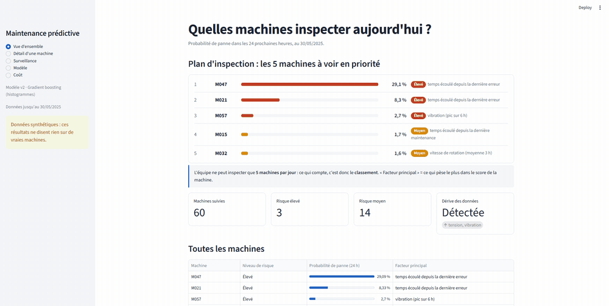

# Plateforme de maintenance prédictive

Plateforme de maintenance prédictive de bout en bout, qui combine Data Engineering, Machine Learning et MLOps, déployable sur AWS.



> **À lire en premier.** Les données sont **synthétiques** et les coûts en euros sont **hypothétiques**. Rien ici ne dit quoi que ce soit sur de vraies machines. Le projet montre l'ingénierie autour d'un modèle (pipelines, tests, surveillance, promotion sécurisée, déploiement), pas un modèle qui fonctionnerait sur un vrai parc.

## Ce que ça fait

Chaque machine reçoit chaque jour un score de risque : *va-t-elle tomber en panne dans les 24 prochaines heures ?* L'équipe de maintenance ne peut inspecter que quelques machines par jour (5 par défaut). Le résultat utile est donc un **classement**, accompagné d'un seuil choisi pour minimiser un coût métier (panne ratée contre inspection inutile).

```
CSV capteurs / erreurs / maintenance ──► PostgreSQL (brut) ──► DBT (staging → intermediate → marts, testés)
                                                                  │
                                       Airflow orchestre          ▼
                                       features ► comparaison des modèles ► registre MLflow (champion / challenger)
                                                                  │
                  dérive (PSI + KS) ► réentraînement sur une fenêtre récente ► promotion seulement si le coût baisse d'au moins 2 %
                                                                  │
                          FastAPI (/predict, /machines, explications) ◄── dashboard Streamlit
                                                                  │
                                  Docker Compose en local · Terraform + GitHub Actions sur AWS
```

## Choix de conception importants

- **Évaluation strictement chronologique.** Les blocs entraînement / calibration / seuil / test suivent le temps. Pas de découpage aléatoire, aucune fuite d'un bloc à l'autre.
- **Probabilités calibrées.** Calibration isotonique sur un bloc séparé, puis seuil optimal en coût sur un autre bloc, avec la même procédure pour tous les modèles.
- **Des métriques adaptées au problème.** PR-AUC comparée au taux de base, précision@N inspections par jour, et coût total en euros comparé à « ne rien faire » et « tout inspecter ».
- **Promotion sécurisée.** Un challenger entraîné après une dérive est comparé au champion sur la *même fenêtre inédite*. Il ne le remplace que si le coût baisse d'au moins 2 %. Chaque décision est écrite dans `logs/promotion_decisions.jsonl`, et `rollback` rétablit le champion précédent.
- **Pas de décalage entraînement/service.** L'API calcule les features avec un chemin numpy rapide, et un test vérifie qu'il donne le même résultat que les features pandas de l'entraînement.
- **Pipelines idempotents.** Les chargements vident puis réinsèrent ; les prédictions sont remplacées par `run_date`. Un test DBT en échec arrête le DAG avant toute nouvelle prédiction ou nouveau modèle.

## Scénario de démonstration (données synthétiques)

`python -m src.cli demo` enchaîne : entraînement de la v1, injection d'une dérive sur une partie des machines, détection (PSI sur la tension et la vibration très au-dessus de 0,2, pression sous le seuil donc non signalée), réentraînement, comparaison, promotion. Un essai témoin sans dérive ne déclenche aucune action. Les chiffres exacts sont dans `dashboard/demo_data/` et dans les pages Modèle et Surveillance du dashboard.

## Démarrage rapide (sans Docker)

```bash
python -m venv .venv && source .venv/bin/activate        # Python 3.12
pip install -r requirements-dev.txt
make demo         # données → entraînement → dérive → réentraînement → promotion → instantané du dashboard
make test
make dashboard    # http://localhost:8501 (lit l'instantané, aucun backend nécessaire)
make api          # http://localhost:8000/docs
```

## Pile complète avec Docker

```bash
cp .env.example .env        # change le mot de passe
docker compose up --build
```

| Service | URL |
|---|---|
| Airflow | http://localhost:8080 |
| MLflow | http://localhost:5000 |
| Documentation de l'API | http://localhost:8000/docs |
| Dashboard | http://localhost:8501 |

Déclenche le DAG `predictive_maintenance_pipeline` dans Airflow. Le mot de passe de l'utilisateur `admin` est affiché dans les logs du conteneur `airflow` au premier démarrage. Une fois le DAG terminé, appelle `POST /admin/reload` sur l'API pour qu'elle charge le modèle.

## AWS

`infrastructure/terraform/` crée un bucket S3, un dépôt ECR, une instance EC2 pour l'API, des rôles IAM au moindre privilège, des alarmes CloudWatch, et en option un budget d'alerte et une base RDS. Voir le README de ce dossier. **Applique-le toi-même avec tes propres identifiants : le dépôt ne contient jamais de clés.** GitHub Actions déploie via OIDC (`deploy.yml`) avec un contrôle de santé et un retour arrière automatique sur l'instance.

## Organisation du dépôt

```
src/            ingestion, features, entraînement, surveillance, registre, CLI
api/            service FastAPI
dbt/            projet DBT (staging, intermediate, marts, tests personnalisés)
airflow/dags/   orchestration
dashboard/      application Streamlit + instantané de démonstration
infrastructure/ Terraform
load_tests/     Locust
tests/          tests unitaires, d'intégration, décalage entraînement/service
docs/           architecture, dictionnaire de données, décisions, fiche modèle, hypothèses de coût
```

## Limites connues

- Les données sont synthétiques : les résultats (PR-AUC modeste sur une tâche volontairement difficile) ne disent rien sur de vrais équipements. Un adaptateur existe pour le jeu de données Azure PdM de Kaggle, mais ses noms de colonnes restent à vérifier sur les vrais fichiers.
- Les coûts sont des hypothèses, voir `docs/cost_assumptions.md`.
- Le champion est choisi sur la PR-AUC du bloc de calibration. Dans certaines exécutions, un autre modèle a un coût de test plus bas. Voir `docs/decisions.md`.
- Les chiffres du test de charge en local (`docs/results.md`) viennent d'une petite machine à 2 cœurs et ne représentent pas les performances sur AWS.
- Terraform n'a été ni appliqué ni déployé sur AWS ; il est seulement validé par la CI (`fmt`, `validate`). Le workflow `deploy.yml` n'a jamais été exécuté.

## Licence

MIT
